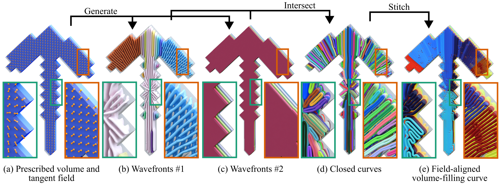

# Wave-Guided Field-Aligned Volume-Filling Curves

This repository contains the reference implementation of **Wave-Guided Field-Aligned Volume-Filling Curves**. For more details, refer to the [project page](https://xavierchermain.github.io/publications/volume-filling-curve).



## Replicability

This code has received the Graphics replicability stamp.

[](http://www.replicabilitystamp.org#https-github-com-iota97-volume-filling-curve)

## Building

The project is designed with minimal dependencies in mind, relying only on the C++17 standard library. This makes the build process straightforward.

### Unix-like systems

Run the following commands:

```
mkdir build && cd build
cmake ..
make -j8
```

### Windows

Create a folder named `build` and run CMake as on Unix-like systems. Then, open the generated solution with Visual Studio and compile it. 
Precompiled binaries are also available [here](https://github.com/iota97/Volume-Filling-Curve/releases).

## Running the Code
Run the program from the `build` folder using the following command:
```
./volume [mesh.stl] [spacing] [curve.ply] <tangent_field> <normal_field>
```
where the tangent fields are:
```
0 -> Constant x-direction [default]
1 -> Constant y-direction
2 -> Constant z-direction
3 -> Two constant piecewise directions
4 -> Radial 1
5 -> Radial 2
6 -> Othogonal to the mesh boundary
7 -> Parallel to the mesh boundary
8 -> Random
9 -> Fancy
```
and the normal fields (Figure 17) are:
```
0 -> Smoothest [default]
1 -> Parallel to boundary
```

To reproduce the results shown in **Figure 12**, run the following commands:

```
./volume ../data/spot.stl 1.0 ../data/spot_two_dir.ply 3
./volume ../data/spot.stl 1.0 ../data/spot_orthogonal.ply 6
./volume ../data/spot.stl 1.0 ../data/spot_parallel.ply 7
./volume ../data/spot.stl 1.0 ../data/spot_random.ply 8
```

The resulting curves are standard PLY files and can be opened with any 3D software, such as Blender.

## Citation
If you use this code in your research, please cite:

```
@article{Cocco2026Wave,
    author = {Cocco, Giovanni and Chermain, Xavier},
    title = {Wave-Guided Field-Aligned Volume-Filling Curves},
    journal = {Computer Graphics Forum (Proceedings of the Symposium on Geometry Processing)},
    year = {2026}
}
```

## License

The source code of this project is provided under the MIT License. See
[LICENSE](LICENSE) for more details.